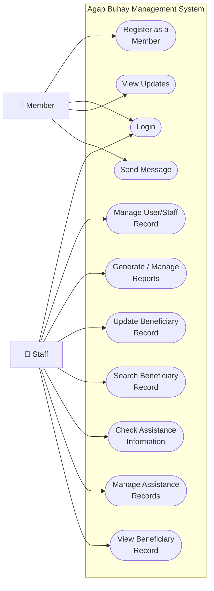

# Use Case Diagram – Agap Buhay Management System

```mermaid
flowchart LR

    %% =========================
    %% MEMBER ACTOR - LEFT SIDE
    %% =========================
    Member["👤 Member"]

    %% =========================
    %% SYSTEM
    %% =========================
    subgraph System["Agap Buhay Management System"]

        direction TB

        Login(["Login"])

        Register(["Register as a<br/>Member"])
        ViewUpdates(["View Updates"])
        SendMessage(["Send Message"])

        ManageUser(["Manage User/Staff<br/>Record"])
        Reports(["Generate / Manage<br/>Reports"])
        UpdateBeneficiary(["Update Beneficiary<br/>Record"])
        SearchBeneficiary(["Search Beneficiary<br/>Record"])
        CheckAssistance(["Check Assistance<br/>Information"])
        ManageAssistance(["Manage Assistance<br/>Records"])
        ViewBeneficiary(["View Beneficiary<br/>Record"])

    end

    %% =========================
    %% STAFF ACTOR - RIGHT SIDE
    %% =========================
    Staff["👤 Staff"]

    %% =========================
    %% MEMBER CONNECTIONS
    %% =========================
    Member --> Register
    Member --> Login
    Member --> ViewUpdates
    Member --> SendMessage

    %% =========================
    %% STAFF CONNECTIONS
    %% =========================
    Staff --> Login
    Staff --> ManageUser
    Staff --> Reports
    Staff --> UpdateBeneficiary
    Staff --> SearchBeneficiary
    Staff --> CheckAssistance
    Staff --> ManageAssistance
    Staff --> ViewBeneficiary
```
