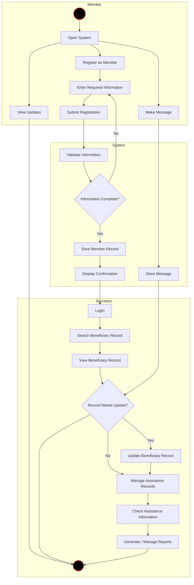

# Activity Diagram

```mermaid
flowchart TB
    subgraph Member
        StartNode((Start))
        OpenSystem["Open System"]
        ViewUpdates["View Updates"]
        MakeMessage["Make Message"]
        Register["Register as Member"]
        EnterInfo["Enter Required Information"]
        SubmitReg["Submit Registration"]
    end

    subgraph System
        Validate["Validate Information"]
        InfoComplete{"Information Complete?"}
        SaveMember["Save Member Record"]
        DisplayConfirm["Display Confirmation"]
        StoreMessage["Store Message"]
    end

    subgraph Secretary
        Login["Login"]
        SearchRecord["Search Beneficiary Record"]
        ViewRecord["View Beneficiary Record"]
        NeedsUpdate{"Record Needs Update?"}
        UpdateRecord["Update Beneficiary Record"]
        ManageAssist["Manage Assistance Records"]
        CheckAssist["Check Assistance Information"]
        Reports["Generate / Manage Reports"]
        FinalNode((End))
    end

    StartNode --> OpenSystem
    OpenSystem --> ViewUpdates
    OpenSystem --> MakeMessage
    OpenSystem --> Register
    Register --> EnterInfo
    EnterInfo --> SubmitReg
    SubmitReg --> Validate
    Validate --> InfoComplete
    InfoComplete -->|No| EnterInfo
    InfoComplete -->|Yes| SaveMember
    SaveMember --> DisplayConfirm
    DisplayConfirm --> Login
    Login --> SearchRecord
    SearchRecord --> ViewRecord
    ViewRecord --> NeedsUpdate

    MakeMessage --> StoreMessage
    StoreMessage --> NeedsUpdate
    ViewUpdates --> FinalNode

    NeedsUpdate -->|Yes| UpdateRecord
    NeedsUpdate -->|No| ManageAssist
    NeedsUpdate --> FinalNode
    UpdateRecord --> ManageAssist
    ManageAssist --> CheckAssist
    CheckAssist --> Reports
    Reports --> FinalNode

    style StartNode fill:#000,stroke:#f00,stroke-width:2px,color:#000
    style FinalNode fill:#000,stroke:#f00,stroke-width:2px,color:#000
```
