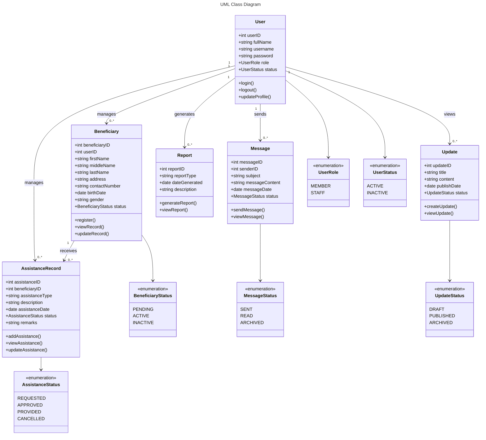

# UML Class Diagram

```mermaid
---
title: UML Class Diagram
---
classDiagram
    class User {
        +int userID
        +string fullName
        +string username
        +string password
        +UserRole role
        +UserStatus status
        +login()
        +logout()
        +updateProfile()
    }

    class Beneficiary {
        +int beneficiaryID
        +int userID
        +string firstName
        +string middleName
        +string lastName
        +string address
        +string contactNumber
        +date birthDate
        +string gender
        +BeneficiaryStatus status
        +register()
        +viewRecord()
        +updateRecord()
    }

    class Message {
        +int messageID
        +int senderID
        +string subject
        +string messageContent
        +date messageDate
        +MessageStatus status
        +sendMessage()
        +viewMessage()
    }

    class Report {
        +int reportID
        +string reportType
        +date dateGenerated
        +string description
        +generateReport()
        +viewReport()
    }

    class Update {
        +int updateID
        +string title
        +string content
        +date publishDate
        +UpdateStatus status
        +createUpdate()
        +viewUpdate()
    }

    class AssistanceRecord {
        +int assistanceID
        +int beneficiaryID
        +string assistanceType
        +string description
        +date assistanceDate
        +AssistanceStatus status
        +string remarks
        +addAssistance()
        +viewAssistance()
        +updateAssistance()
    }

    class UserRole {
        <<enumeration>>
        MEMBER
        STAFF
    }

    class UserStatus {
        <<enumeration>>
        ACTIVE
        INACTIVE
    }

    class BeneficiaryStatus {
        <<enumeration>>
        PENDING
        ACTIVE
        INACTIVE
    }

    class MessageStatus {
        <<enumeration>>
        SENT
        READ
        ARCHIVED
    }

    class AssistanceStatus {
        <<enumeration>>
        REQUESTED
        APPROVED
        PROVIDED
        CANCELLED
    }

    class UpdateStatus {
        <<enumeration>>
        DRAFT
        PUBLISHED
        ARCHIVED
    }

    User "1" --> "0..*" Beneficiary : manages
    User "1" --> "0..*" AssistanceRecord : manages
    User "1" --> "0..*" Message : sends
    User "1" --> "0..*" Report : generates
    User "1" --> "0..*" Update : views
    Beneficiary "1" --> "0..*" AssistanceRecord : receives

    User --> UserRole
    User --> UserStatus
    Beneficiary --> BeneficiaryStatus
    Message --> MessageStatus
    AssistanceRecord --> AssistanceStatus
    Update --> UpdateStatus
```
