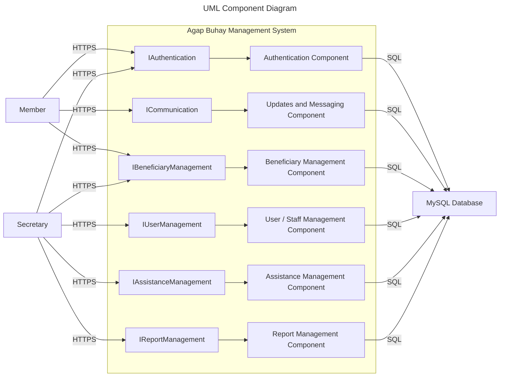

# UML Component Diagram

```mermaid
---
title: UML Component Diagram
---
flowchart LR
    Member["Member"]
    Secretary["Secretary"]

    subgraph System["Agap Buhay Management System"]
        direction LR
        IAuth["IAuthentication"] --> AuthComp["Authentication Component"]
        IComm["ICommunication"] --> CommComp["Updates and Messaging Component"]
        IBenef["IBeneficiaryManagement"] --> BenefComp["Beneficiary Management Component"]
        IUser["IUserManagement"] --> UserComp["User / Staff Management Component"]
        IAssist["IAssistanceManagement"] --> AssistComp["Assistance Management Component"]
        IReport["IReportManagement"] --> ReportComp["Report Management Component"]
    end

    DB["MySQL Database"]

    Member -->|HTTPS| IAuth
    Member -->|HTTPS| IComm
    Member -->|HTTPS| IBenef

    Secretary -->|HTTPS| IAuth
    Secretary -->|HTTPS| IBenef
    Secretary -->|HTTPS| IUser
    Secretary -->|HTTPS| IAssist
    Secretary -->|HTTPS| IReport

    AuthComp -->|SQL| DB
    CommComp -->|SQL| DB
    BenefComp -->|SQL| DB
    UserComp -->|SQL| DB
    AssistComp -->|SQL| DB
    ReportComp -->|SQL| DB
```
