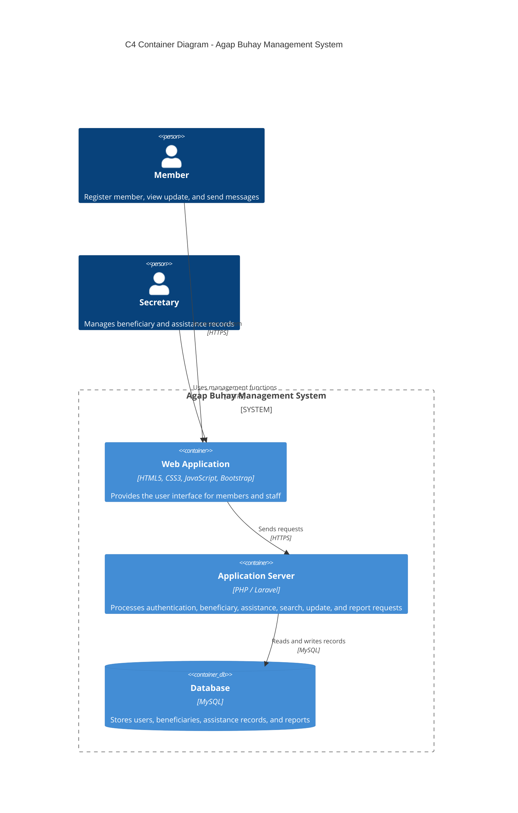

# C4 Container Diagram - Agap Buhay Management System

```mermaid
C4Container
    title C4 Container Diagram - Agap Buhay Management System

    Person(member, "Member", "Register member, view update, and send messages")
    Person(secretary, "Secretary", "Manages beneficiary and assistance records")

    System_Boundary(abms, "Agap Buhay Management System") {
        Container(web, "Web Application", "HTML5, CSS3, JavaScript, Bootstrap", "Provides the user interface for members and staff")
        Container(app, "Application Server", "PHP / Laravel", "Processes authentication, beneficiary, assistance, search, update, and report requests")
        ContainerDb(db, "Database", "MySQL", "Stores users, beneficiaries, assistance records, and reports")
    }

    Rel(member, web, "Accesses system", "HTTPS")
    Rel(secretary, web, "Uses management functions", "HTTPS")
    Rel(web, app, "Sends requests", "HTTPS")
    Rel(app, db, "Reads and writes records", "MySQL")

    UpdateLayoutConfig($c4ShapeInRow="3", $c4BoundaryInRow="1")
```
