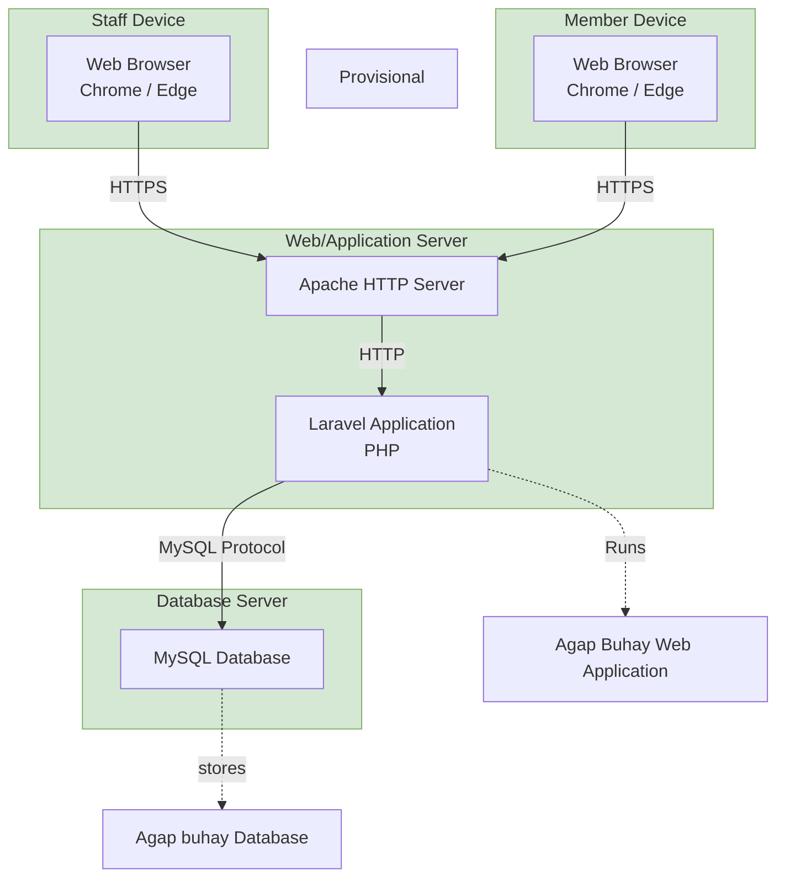

## Deployment Diagram
 

```mermaid
flowchart TB
    provisional["Provisional"]
 
    subgraph staffDevice["Staff Device"]
        staffBrowser["Web Browser<br/>Chrome / Edge"]
    end
 
    subgraph memberDevice["Member Device"]
        memberBrowser["Web Browser<br/>Chrome / Edge"]
    end
 
    subgraph appServer["Web/Application Server"]
        apache["Apache HTTP Server"]
        laravel["Laravel Application<br/>PHP"]
    end
 
    subgraph dbServer["Database Server"]
        mysql["MySQL Database"]
    end
 
    webApp["Agap Buhay Web Application"]
    dbArtifact["Agap buhay Database"]
 
    staffBrowser -->|HTTPS| apache
    memberBrowser -->|HTTPS| apache
    apache -->|HTTP| laravel
    laravel -->|MySQL Protocol| mysql
 
    laravel -. Runs .-> webApp
    mysql -. stores .-> dbArtifact
 
    classDef node fill:#d5e8d4,stroke:#82b366,color:#333
    classDef artifact fill:#ececff,stroke:#9370db,color:#333
    class staffDevice,memberDevice,appServer,dbServer node
    class provisional,webApp,dbArtifact,staffBrowser,memberBrowser,apache,laravel,mysql artifact
```
