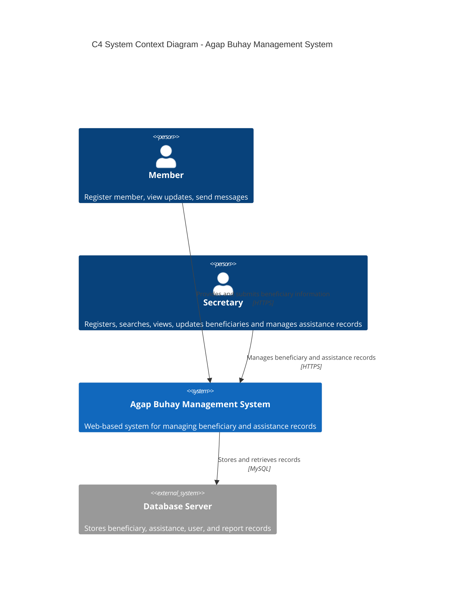

# C4 System Context Diagram - Agap Buhay Management System

```mermaid
C4Context
    title C4 System Context Diagram - Agap Buhay Management System

    Person(member, "Member", "Register member, view updates, send messages")
    Person(secretary, "Secretary", "Registers, searches, views, updates beneficiaries and manages assistance records")

    System(abms, "Agap Buhay Management System", "Web-based system for managing beneficiary and assistance records")
    System_Ext(db, "Database Server", "Stores beneficiary, assistance, user, and report records")

    Rel(member, abms, "Provides and submits beneficiary information", "HTTPS")
    Rel(secretary, abms, "Manages beneficiary and assistance records", "HTTPS")
    Rel(abms, db, "Stores and retrieves records", "MySQL")

    UpdateLayoutConfig($c4ShapeInRow="2", $c4BoundaryInRow="1")
```
