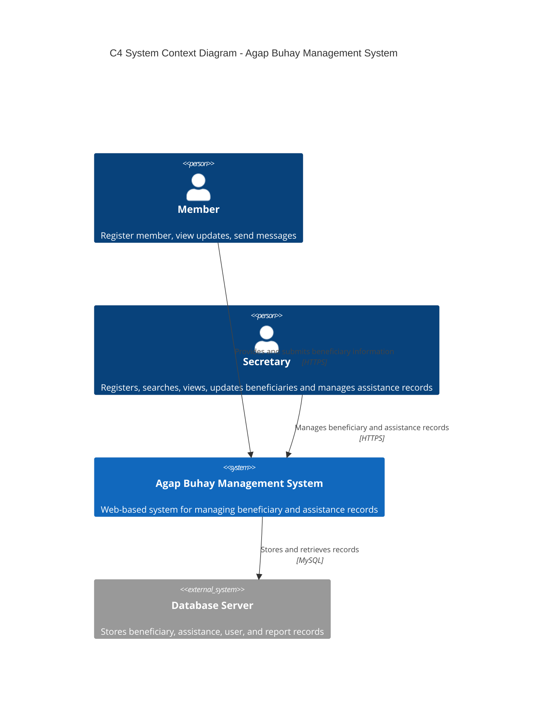
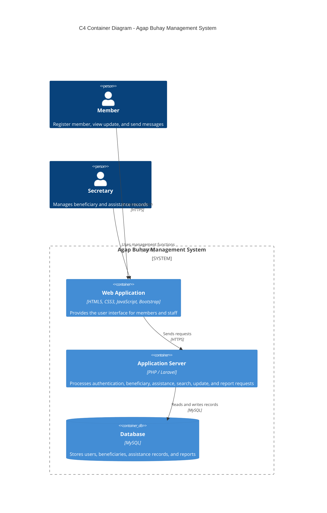
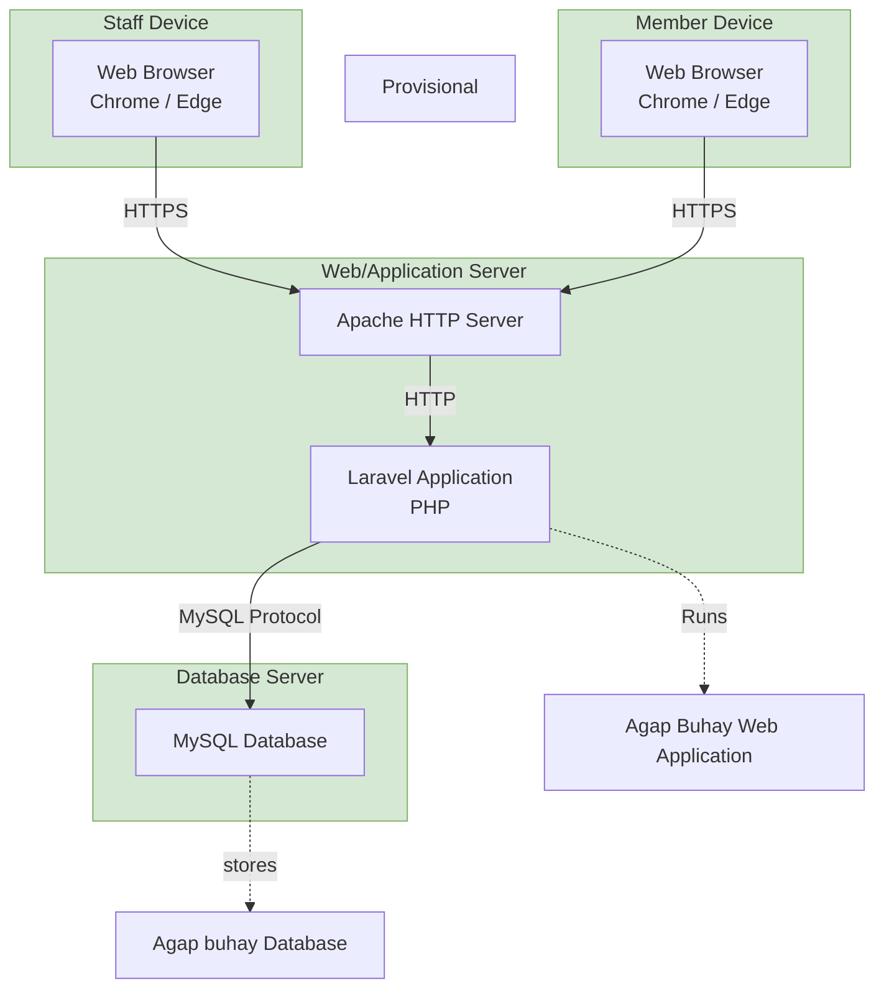

# Agap Buhay Management System

Web-based system for managing beneficiary and assistance records.

## C4 System Context Diagram

## C4 Container Diagram

## Deployment Diagram

<!-- Optional: for the exact draw.io look (3D boxes), add Deployment_Diagram.svg to docs/ and use:

-->
