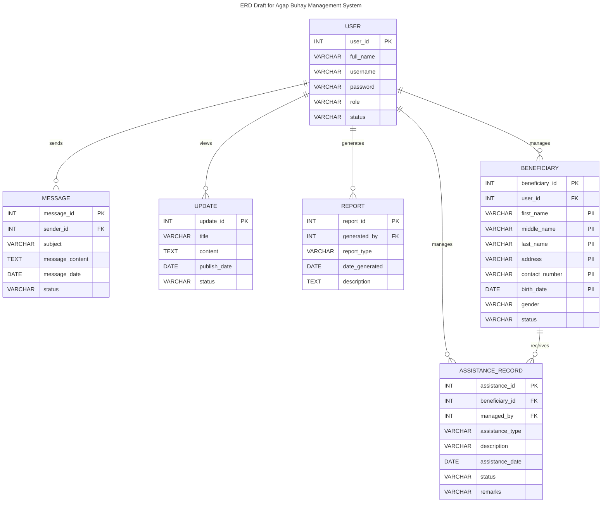

# ERD Draft for Agap Buhay Management System

```mermaid
---
title: ERD Draft for Agap Buhay Management System
---
erDiagram
    USER ||--o{ MESSAGE : sends
    USER ||--o{ UPDATE : views
    USER ||--o{ REPORT : generates
    USER ||--o{ BENEFICIARY : manages
    USER ||--o{ ASSISTANCE_RECORD : manages
    BENEFICIARY ||--o{ ASSISTANCE_RECORD : receives

    USER {
        INT user_id PK
        VARCHAR full_name
        VARCHAR username
        VARCHAR password
        VARCHAR role
        VARCHAR status
    }

    MESSAGE {
        INT message_id PK
        INT sender_id FK
        VARCHAR subject
        TEXT message_content
        DATE message_date
        VARCHAR status
    }

    UPDATE {
        INT update_id PK
        VARCHAR title
        TEXT content
        DATE publish_date
        VARCHAR status
    }

    REPORT {
        INT report_id PK
        INT generated_by FK
        VARCHAR report_type
        DATE date_generated
        TEXT description
    }

    BENEFICIARY {
        INT beneficiary_id PK
        INT user_id FK
        VARCHAR first_name "PII"
        VARCHAR middle_name "PII"
        VARCHAR last_name "PII"
        VARCHAR address "PII"
        VARCHAR contact_number "PII"
        DATE birth_date "PII"
        VARCHAR gender
        VARCHAR status
    }

    ASSISTANCE_RECORD {
        INT assistance_id PK
        INT beneficiary_id FK
        INT managed_by FK
        VARCHAR assistance_type
        VARCHAR description
        DATE assistance_date
        VARCHAR status
        VARCHAR remarks
    }
```
