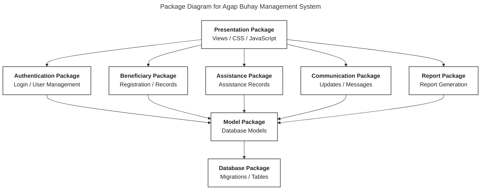

# Package Diagram for Agap Buhay Management System

```mermaid
---
title: Package Diagram for Agap Buhay Management System
---
flowchart TB
    Presentation["<b>Presentation Package</b><br/>Views / CSS / JavaScript"]

    Auth["<b>Authentication Package</b><br/>Login / User Management"]
    Beneficiary["<b>Beneficiary Package</b><br/>Registration / Records"]
    Assistance["<b>Assistance Package</b><br/>Assistance Records"]
    Communication["<b>Communication Package</b><br/>Updates / Messages"]
    Report["<b>Report Package</b><br/>Report Generation"]

    Model["<b>Model Package</b><br/>Database Models"]
    Database["<b>Database Package</b><br/>Migrations / Tables"]

    Presentation --> Auth
    Presentation --> Beneficiary
    Presentation --> Assistance
    Presentation --> Communication
    Presentation --> Report

    Auth --> Model
    Beneficiary --> Model
    Assistance --> Model
    Communication --> Model
    Report --> Model

    Model --> Database

    classDef pkg fill:#fff,stroke:#333,stroke-width:1.5px,color:#222
    class Presentation,Auth,Beneficiary,Assistance,Communication,Report,Model,Database pkg
```
