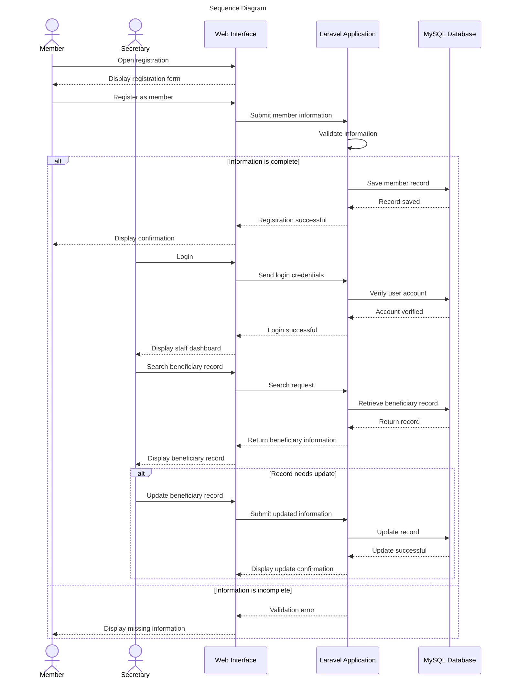

# Sequence Diagram

```mermaid
---
title: Sequence Diagram
---
sequenceDiagram
    actor Member
    actor Secretary
    participant Web as Web Interface
    participant App as Laravel Application
    participant DB as MySQL Database

    Member->>Web: Open registration
    Web-->>Member: Display registration form
    Member->>Web: Register as member
    Web->>App: Submit member information
    App->>App: Validate information

    alt Information is complete
        App->>DB: Save member record
        DB-->>App: Record saved
        App-->>Web: Registration successful
        Web-->>Member: Display confirmation

        Secretary->>Web: Login
        Web->>App: Send login credentials
        App->>DB: Verify user account
        DB-->>App: Account verified
        App-->>Web: Login successful
        Web-->>Secretary: Display staff dashboard

        Secretary->>Web: Search beneficiary record
        Web->>App: Search request
        App->>DB: Retrieve beneficiary record
        DB-->>App: Return record
        App-->>Web: Return beneficiary information
        Web-->>Secretary: Display beneficiary record

        alt Record needs update
            Secretary->>Web: Update beneficiary record
            Web->>App: Submit updated information
            App->>DB: Update record
            DB-->>App: Update successful
            App-->>Web: Display update confirmation
        end
    else Information is incomplete
        App-->>Web: Validation error
        Web-->>Member: Display missing information
    end
```
